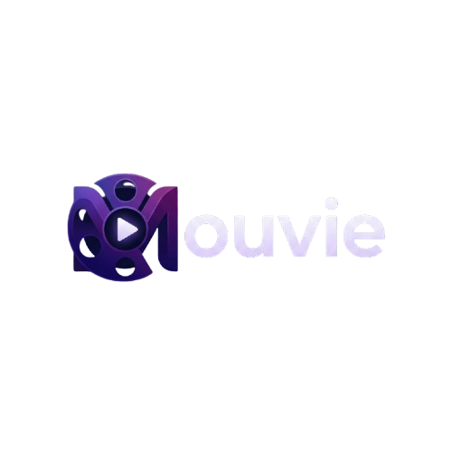

<div align="center">
 
</div>

<div align="center">
  
  
  
</div>

<br/>

**Live App:** [https://movie-search-mu-three.vercel.app/](https://movie-search-mu-three.vercel.app/)

A modern, premium discovery platform for Movies, Series, and Anime that bridges the gap between finding content and actually watching it. Built with React 19, Tailwind v4, and powered by TMDB API and Appwrite. Mouvie features intelligent categorization, smart trailer fetching, and a visually stunning "Space Dark" aesthetic with Netflix-style hover interactions.

---

## 📖 Overview

Mouvie solves a common problem: finding where to watch your favorite movies and anime without the hassle. It combines a beautiful, responsive interface with smart features like personalized favorites, watch history, and AI-driven recommendations.

### Key Highlights

🎯 **Hero Carousel** - Dynamic, auto-scrolling hero section blending the top 30 movies, series, and animes with premium fade-in typography, hover effects, and keyboard navigation.
🎯 **Smart Streaming Selection** - Auto-detects Anime vs. Movies and routes to the best sources (AnimeSuge, HiAnime, Nkiri).  
🍿 **Trending Categories** - Distinct trending sections for Movies, TV Series, and Anime, completely deduplicated for a seamless browsing experience.  
✨ **Netflix-Style Hover Cards** - Interactive hover cards that dynamically adjust to your viewport.  
🛡️ **Unreleased Title Protection** - Intelligently hides streaming options for content that hasn't premiered yet.  
❤️ **Personalization** - "Favorites" and "Watch History" that persist across sessions.  
🧠 **Smart Recommendations** - "You might also like" suggestions tailored to every title.  
📱 **Universal Design** - Flawless experience on both Mobile (Bottom Nav) and Desktop (Top Nav).  
⚡ **Performance** - 2-second debounced search with loading indicators, lazy-loaded images, and skeleton states.  

---

## 📸 Screenshots

<div align="center">
    
    
    
</div>

---

## ⚙️ Tech Stack

| Technology | Purpose |
|------------|---------|
| **React 19.2** | UI library with Hooks and Functional Components |
| **Vite 7.1** | Next-generation frontend tooling |
| **Tailwind CSS 4.1** | Utility-first CSS framework for styling |
| **Appwrite 21.3** | Backend-as-a-Service for Trending Movies data |
| **TMDB API** | Movie metadata, posters, trailers, and recommendations |
| **react-use** | Essential hooks utility library |
| **framer-motion** | Smooth animations and transitions |

---

## 🔋 Features

### 🔍 Search & Discovery
- **Real-time Search**: 2-second debounced input with a custom animated loading spinner. Hides trending sections instantly upon typing to focus purely on results.
- **Rich Metadata**: Displays posters, match percentages, release years, and languages.
- **Loading States**: Shimmering skeletons for a perceived faster load time.

### 🎭 Smart Movie & TV Modal
Click any movie or show to reveal a feature-rich modal with smooth layout transitions:
- **Streaming Options**: Direct links to **AnimeSuge / HiAnime** (for anime) or **Nkiri / Net77 / CineHD** (for movies).
- **Strict Release Date Checks**: Protects against fake API statuses by strictly comparing calendar release dates to safely lock streaming options for unreleased media.
- **TV & Anime Episode Tracker**: Live TVmaze integration automatically fetches global air times for the next episode and converts it to a highly-precise ticking countdown timer in your local timezone.
- **Advanced Trailer Fetching**: Multi-language trailer support pulls official Japanese, Korean, or Chinese trailers when available. 
- **Geoblock Fallback**: If a studio region-blocks their YouTube trailer, a smart fallback button allows you to instantly search YouTube for fan re-uploads.
- **Recommendations**: A horizontal carousel of similar movies.

### 👤 Personalization
- **Favorites System**: Heart (<3) any movie to save it to your personal "Favorites" list.
- **Watch History**: Automatically tracks the last 20 movies you've viewed.
- **Persisted Data**: Your data is saved via `localStorage`, so it's there when you return.

### 📱 Responsive & Adaptive UI
The app adapts its navigation based on the device:
- **Dynamic Tooltips**: Hover cards calculate screen boundaries to never get cut off by the browser window.
- **Mobile**: Sticky Bottom Navigation Bar (Home, Search, Favorites) and swipe-to-dismiss modals.
- **Desktop**: Sleek Top Navigation menu.

---

## 📦 Installation & Setup

### Prerequisites
- Node.js v18+
- TMDB API Key (Free)
- Appwrite Project (Optional, for Trending feature)

### 1. Clone & Install
```bash
git clone https://github.com/Moubarak-01/Movie-Search-App-.git
cd Movie-Search-App-
npm install
```

### 2. Configure Environment
Create a `.env` file in the root directory. You will need API keys from:
- [TMDB (The Movie Database)](https://developer.themoviedb.org/docs/getting-started)
- [Appwrite](https://appwrite.io/)

```env
VITE_TMDB_API_KEY=your_tmdb_api_key_here
VITE_APPWRITE_PROJECT_ID=your_project_id
VITE_APPWRITE_DATABASE_ID=your_database_id
VITE_APPWRITE_COLLECTION_ID=your_collection_id
VITE_APPWRITE_ENDPOINT=https://cloud.appwrite.io/v1
```

### 3. Run Development Server
```bash
npm run dev
```
Visit `http://localhost:5173` to see the app in action!

---

## 🤝 Contributing

Contributions are always welcome!
1. Fork the Project
2. Create your Feature Branch (`git checkout -b feature/AmazingFeature`)
3. Commit your Changes (`git commit -m 'Add some AmazingFeature'`)
4. Push to the Branch (`git push origin feature/AmazingFeature`)
5. Open a Pull Request

---

## 📄 License

Distributed under the MIT License. See `LICENSE` for more information.

---

## 👨‍💻 Author

**Moubarak**  
- GitHub: [@Moubarak-01](https://github.com/Moubarak-01)  
- Project Link: [Mouvie](https://github.com/Moubarak-01/Movie-Search-App)

---

## 🙏 Acknowledgments

- **TMDB API** for the incredible movie database.
- **Appwrite** for the seamless backend integration.
- **AnimeSuge, HiAnime & Nkiri** for streaming capabilities.
